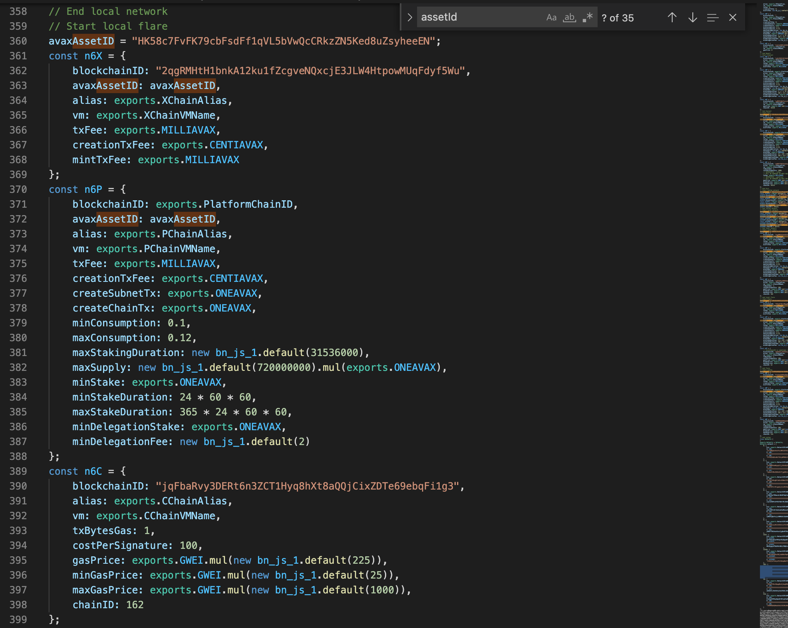
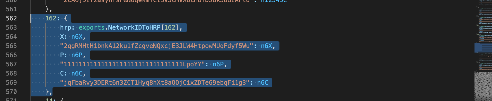

## How to run testcases
1. Run `yarn install` to install the dependencies
2. Create an .env with following content:
```
PRIVATE_KEY_CB58 = "88b3cf6b7e9ef18a508209d61311a376bde77be5d069449b1eace71130f8252c"
PRIVATE_KEY_HEX = "88b3cf6b7e9ef18a508209d61311a376bde77be5d069449b1eace71130f8252c"
PUBLIC_KEY = "04423fb5371af0e80750a6481bf9b4adcf2cde38786c4e613855b4f629f8c45ded6720e3335d1110c112c6d1c17fcbb23b9acc29ae5750a27637d385991af15190"
```
3. Create a ctx.json with the following content:
```
{
  "publicKey": "04423fb5371af0e80750a6481bf9b4adcf2cde38786c4e613855b4f629f8c45ded6720e3335d1110c112c6d1c17fcbb23b9acc29ae5750a27637d385991af15190",
  "network": "localflare"
}
```
4. Run the docker conatiner via `docker-compose up -d`
5. Go to test/helper. and run node queryChain. It will generate output similar to this(note that it may vary):
```
assetId: HK58c7FvFK79cbFsdFf1qVL5bVwQcCRkzZN5Ked8uZsyheeEN
blockchainId for X-chain: ecxi7p3JMYsx6abaYt7b9YiGbj6okQUs8QpqSxMKsFwEioff1
blockchainId for C-chain: 2PyHrN5q8uF7tFLHsiCmG7tmkFWMDjikuYJgnHAXV83o8wMTFD
blockchainId for P-chain: 11111111111111111111111111111111LpoYY
```

6. Now go to node_modules/@flarenetwork/flarejs/dist/utils/constants.js and make changes for the P-chain, C-chain, X-chain and assetId in the following places:


a. Replace avaxAssetId with the assetId

b. Replace blockchainId in n6x with X-chain id

c. Replace blockchainId in n6c with C-chain id

Similarly, for the following part:


a. Replace the key for n6x with X-chain id

b. Replace the key for n6c with C-chain id

7. Run `yarn run coverage` to generate the coverage report
8. As we were facing issue with ledger, so we have created separate command to run the testcases:

a. For `ledger/sign` - `yarn run ledger-sign-testcase`

b. For `ledger/key` - `yarn run ledger-key-testcase`

c. For `ledger/utils` - `yarn run ledger-utils-testcase`

d. For `cli` - `yarn run cli-testcase`